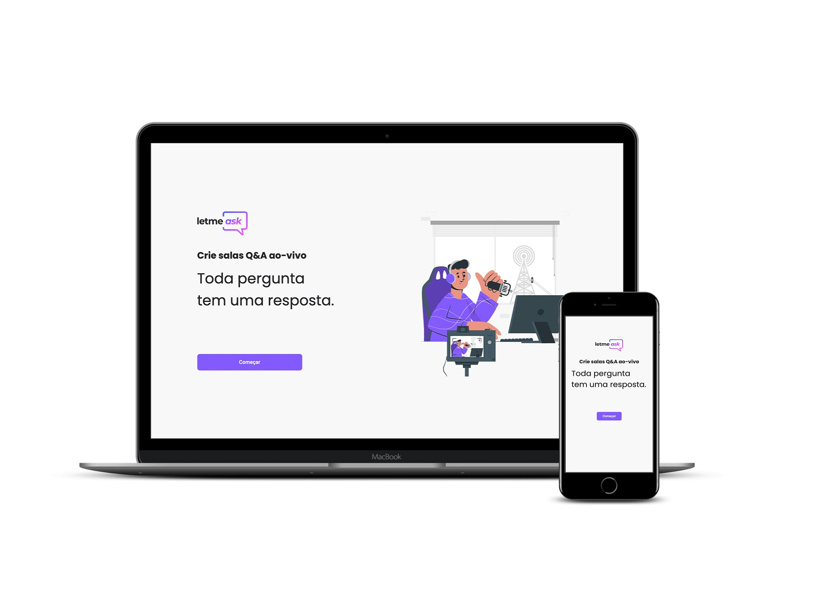
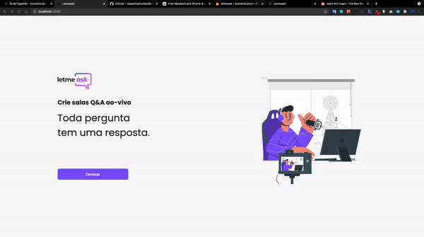

<br/>
<p align="center">
     
</p>
<p align="center">
     
</p>
<h2 align="center"> 

</h2>
<br>

# Índice
   * [Descrição do Projecto](#descrição-do-projecto)
   * [Features](#-features)
   * [Tecnologias usadas](#-tecnologias-usadas)
   * [Desafios do Projecto](#-desafios-do-projecto)
   * [Pré-requisitos](#-pré-requisitos)
   * [Rodando o projecto na sua maquina](#-rodando-o-projecto-na-sua-maquina-iniciando-o-servidor)
   * [Licença](#-licença)


## 📖 Descrição do Projecto

<p align="center">
Letmeask é um aplicativo para criar salas de perguntas e respostas o <strong>Letmeask</strong> pode ser o usado para auxiliar numa live, o usuário poderá criar uma sala e compartilhar o código dela para outros para entrarem e fazer as suas perguntas.
</p>
<p align="center">
     
</p>
<h1 align="center"><a target="_blank" href="https://letmeask-3fc59.web.app/">Acessar Demonstração</a></h1>

## ✅ Features
  - [x] Fazer login com o Google
  - [x] Criar sala
  - [x] Compartilhar código da sala
  - [x] Destacar a pergunta que esta a ser a respondida
  - [x] Eliminar pergunta
  - [x] Encerrar sala


<p align="center">
  <!--  -->
</p>

---
## 🛠 Tecnologias usadas

As seguintes ferramentas foram usadas na construção do projeto:


- SASS
- ReactJs
- Typescript
- React Router Dom 
- React Hot Toast
- ContextApi
- Hooks
- Firebase Realtime Database
- Firebase Authentication

---

## ⛈  Desafios do projecto
  - [x] Responsividade
 

---

## ⚠ Pré-requisitos

Antes de começar, você vai precisar ter instalado em sua máquina as seguintes ferramentas:
[Git](https://git-scm.com), [Node.js](https://nodejs.org/en/). 
Além disto é bom ter um editor para trabalhar com o código como [VSCode](https://code.visualstudio.com/)

---
## 🎲 Rodando o projecto na sua maquina (iniciando o live server)

```bash
# Clone este repositório
$ git clone <https://github.com/isaiasnhantumbo/letmeask.git>

# Acesse a pasta do projeto no terminal/cmd
$ cd letmeask

# Abra a pasta no Visual Studio Code
$ code .

# Instale as dependência
$ yarn install

# Execute a aplicação com o yarn
$ yarn start

# O servidor inciará na porta:3000 - acesse <http://localhost:3000>
```

---


## 📘 Licença
Este projecto usa a  [MIT License](LICENSE).
****
<h1 align="center">
👨🏽‍🏫 
<br>
Desenvolvido por
<br>
 Isaias Nhantumbo Junior
</h1>
</p>
<h1 align="center"> 🤝 &nbsp;Vamos nos conectar ?👨 </h1>

<p align="center">
<a href="https://www.youtube.com/channel/UCOyeYkH0MwJ6RrXTcEFFdAQ?view_as=subscriber"></a>
<a href="https://www.linkedin.com/in/isaias-nhantumbo-junior-733bb619b/"></a>
<a href="https://www.instagram.com/isaias_nhantumbo/"></a>
</p>


